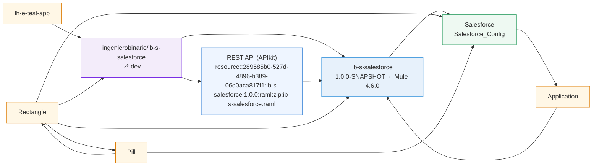

# Architecture — ib-s-salesforce

> Generated by **FluxMule** · by Ingeniero Binario.

- **Repository:** `ingenierobinario/ib-s-salesforce` @ `dev`
- **Application:** `ib-s-salesforce` v1.0.0-SNAPSHOT · Mule 4.6.0

## Exposes

| API / Source | Detail |
|---|---|
| REST API (APIkit) | resource::289585b0-527d-4896-b389-06d0aca817f1:ib-s-salesforce:1.0.0:raml:zip:ib-s-salesforce.raml |

## Consumes

| System | Detail |
|---|---|
| Salesforce | Salesforce_Config |
