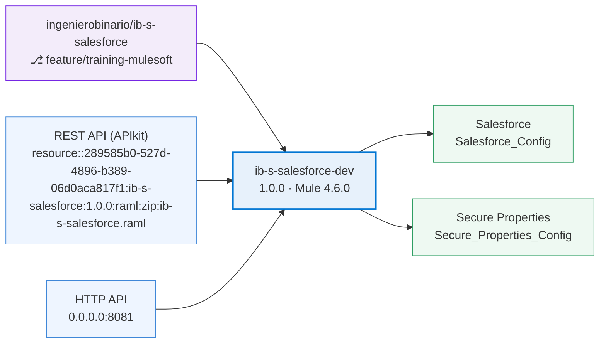

# Architecture — ib-s-salesforce-dev

> Generated by **FluxMule** · by Ingeniero Binario.

- **Repository:** `ingenierobinario/ib-s-salesforce` @ `feature/training-mulesoft`
- **Application:** `ib-s-salesforce-dev` v1.0.0 · Mule 4.6.0

## Exposes

| API / Source | Detail |
|---|---|
| REST API (APIkit) | resource::289585b0-527d-4896-b389-06d0aca817f1:ib-s-salesforce:1.0.0:raml:zip:ib-s-salesforce.raml |
| HTTP API | 0.0.0.0:8081 |

## Consumes

| System | Detail |
|---|---|
| Salesforce | Salesforce_Config |
| Secure Properties | Secure_Properties_Config |
